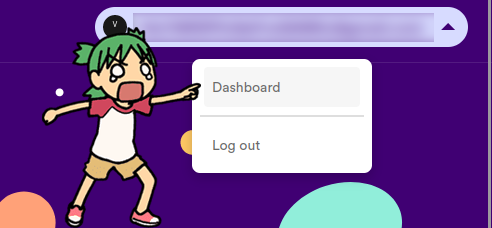
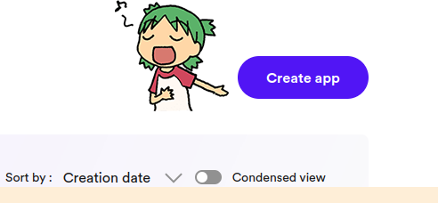
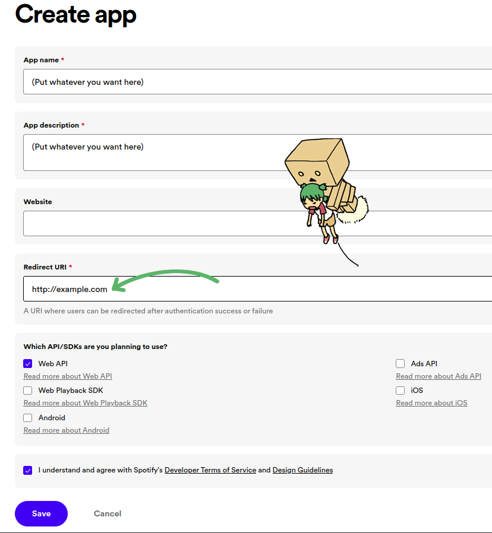
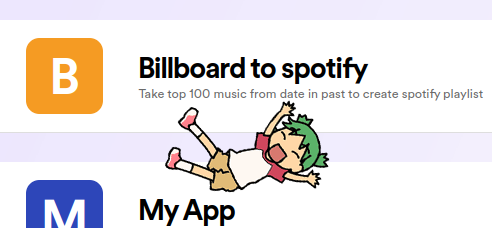
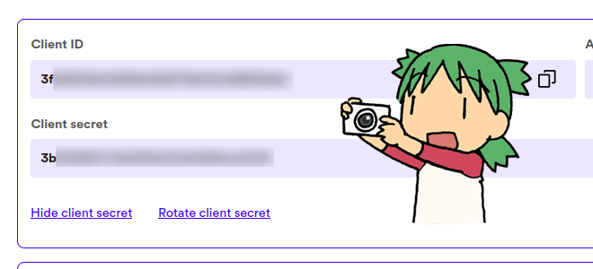
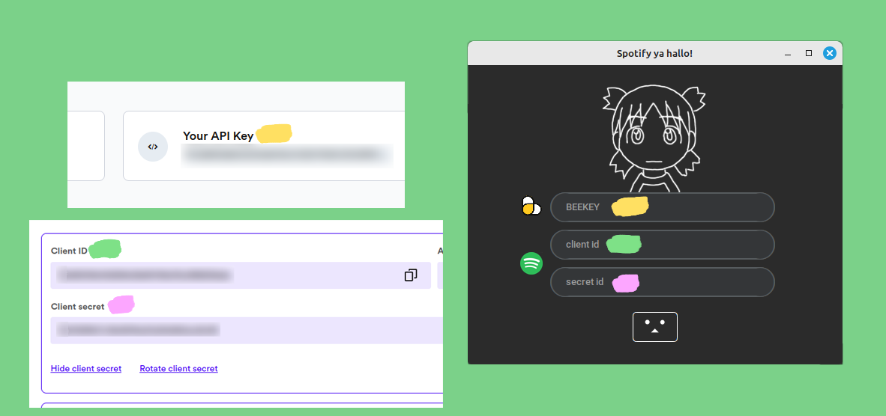
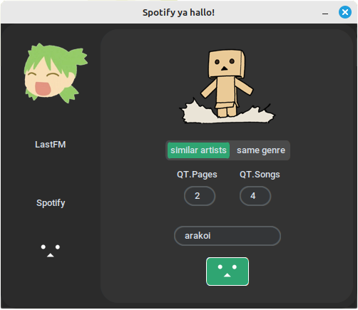
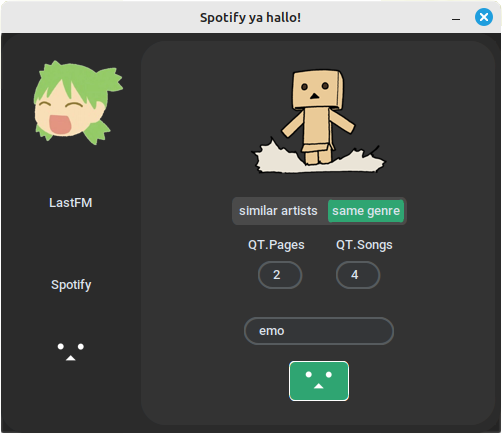
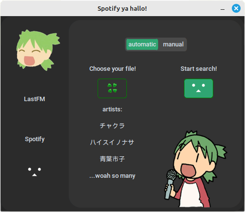
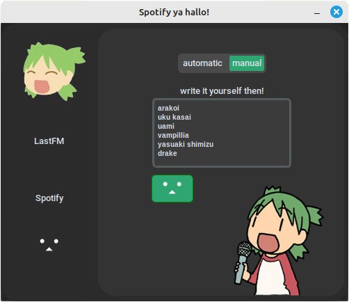

# Project Name

## Description
This project is an artist searcher. It aims to add songs to a spotify playlist by searching for similar artists or genres. The project is built using python and some libraries.

## Table of Contents
- [Installation](#installation)
- [Usage](#usage)
- [Features](#features)
- [Contact](#contact)

## Installation

1. Clone the repository:
    ```sh
    git clone https://github.com/fingledingle/lastfm_scraper
    ```
2. Navigate to the project directory:
    ```sh
    cd lastfm_scraper
    ```
3. Install the dependencies:
    ```sh
    pip install -r requirements.txt
    ```
4. Set up the Scrapingbee:

    1. Access `https://www.scrapingbee.com/` website.
    2. Make your own account.
    3. Copy and save the Api Key or you can access it later


5. Set up SpotifyApp:
    
    1. Access `https://developer.spotify.com/` This is where you will make your App


    2. Log-in with your spotify account
    - Once you're in the developer page access the dashboard.

        
    - Create your app by pressing the 'Create App' button.

        
    - Once you're at the Create app page simply just follow the example.

        
    ATTENTION THE URI BEING `http://example.com` is necessary do not skip.

    - After saving it and creating your app headback to the dashboard where you will see your app.
        
    - Upon clicking on your app you will be able to view your keys.
        


    


## Usage

1. Start the development server:
    ```sh
    python main.py
    ```
2. Once the program is up and running you will see the main page where you should fill in wth your keys.
    <!-- <div align="center"> -->
    
    <!-- </div> -->
    


## Features
- Search by similar artists: 
    1. You can just input the target artist and it will retreive artists with similar music
    2. QT.pages being the quantity of pages you wanna sort through. 1 page = 10 artists
    3. QT.songs being the quantity of songs per artist
    ### Example

    

<br>

- Search by similar artists
    1. You can just input the target genre and it will retreive artists within same genre (might be inaccurate given there's subgenres)
    ### Example

    

<br>


- Search by your own txt list!
    1. By clicking on Choose your file, you are able to use your own txt file 
    just make sure it follows this example
        ```
        Jeff
        Jeffrey
        Jefferson
        ```
    2. After that you can click Start search button and it will add 5 songs by each on a spotify playlist
    ### Example

    

<br>

- Type it yourself!
    1. You can also write the artists yourself! Just make sure to follow the example.

    2. After that you can click Start search button and it will add 5 songs by each on a spotify playlist.
    ### Example

    


## HAVE AN AWESOME DAY! 🫧
<div align="center">
  
</div>


## Contact
Maintainer - [Email](https://github.com/fingledingle) - [marky02381@outlook.jp](mailto:marky02381@outlook.jp) | 「Discord」 - bb4dk9by2h

Project Link: [https://github.com/fingledingle/lastfm_scraper](https://github.com/fingledingle/lastfm_scraper)
